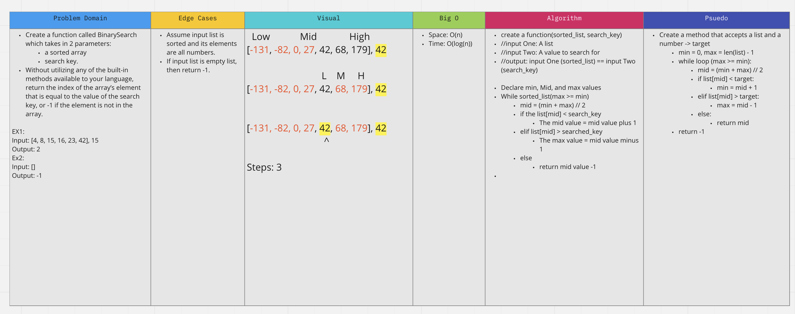

# Binary Search - 12/13/2021

**Author**: Wenhao Piao  
**Pair programming partner**: Ediberto Ponce

Write a function called `binary_search`. It takes two parameters: a sorted list and the search key. In each search, it compares middle element of the list and the search key to eliminate half of the elements. It keeps doing it until it finds the search key and return its index. If it doesn't find the search key, it would return -1.

## Whiteboard Process

## Approach & Efficiency

- Approach:
  - Algorithm:
    - Create a function that accepts a list and a number
      - Initialize: min = 0, max = len(list) - 1
      - while loop: max >= min
        - mid = (min + max) // 2
        - if list[mid] < target:
          - min = mid + 1
        - elif list[mid] > target:
          - max = mid - 1
        - else:
          - return mid
      - return -1
- Efficiency:
  - Time complexity: O(log n) - the algorithm would eliminate half of the list in each search
