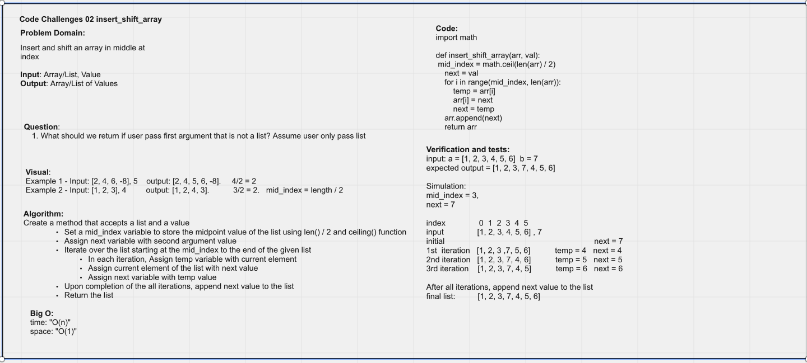

# Insert to Middle of an Array - 12/09/2021

**Author**: Wenhao Piao  
**Pair programming partner**: Joshua Huston

Write a function called `insert_shift_array` which takes in an array and a value to be added. Without utilizing any of the built-in methods available to your language, return an array with the new value added at the middle index.

## Whiteboard Process

## Approach & Efficiency

- Approach:
  - Algorithm:
    - Create a function that accepts a list and a value
      - Assign mid_index variable with `math.ceil(len(list) / 2)
      - Assign next variable with second argument value
      - Iterate over the list starting at the mid_index to the end of the input list
        - In each iteration, assign temp variable with current element
        - Assign current element of the list with next value
        - Assign next variable with temp value
      - Upon completion of the all iterations, append next value to the list
      - Return the list
- Efficiency:
  - Time complexity: O(n) - the algorithm would iterate over half of the input list
